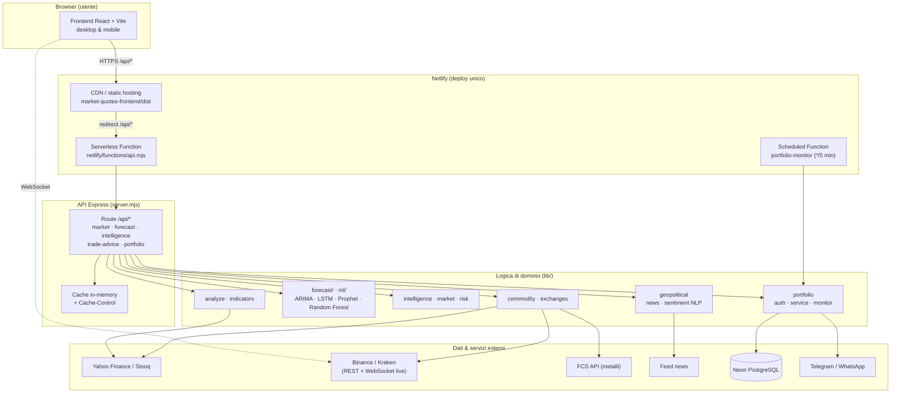

# Market Monitor

Piattaforma web per l'analisi e il monitoraggio dei mercati finanziari: quotazioni, grafici storici, indicatori tecnici, previsioni multi-metodo, contesto geopolitico e gestione di un portfolio personale con alert.

> **Disclaimer.** L'app **non** esegue ordini in borsa, **non** gestisce denaro reale e **non** sostituisce un consulente finanziario abilitato. È uno strumento **informativo ed educativo** basato su dati pubblici e modelli statistici. L'utente è l'unico responsabile delle proprie decisioni di investimento.

> 📈 **Roadmap dei miglioramenti** (frontend, backend, ML, DevOps) con priorità ed effort: [`docs/ROADMAP.md`](docs/ROADMAP.md).

---

## Obiettivi

- **Punto di accesso unico** a molte classi di asset (azioni, indici, forex, crypto, metalli, materie prime, ETF, macro).
- **Analisi guidata in 4 passi** (Scegli → Analizza → Consigli → Prevedi), intuitiva anche su mobile.
- **Integrare** analisi tecnica, macro, geopolitica e rischio in un'unica sintesi operativa orientativa (acquisto / vendita / mantieni).
- **Confrontare** più metodi di previsione sullo stesso grafico.
- **Tracciare** un portfolio personale con calcolo P/L e alert automatici (Telegram / WhatsApp).
- **Trasparenza** su fonti dati, modelli utilizzati e limiti legali.

## A chi si rivolge

Investitori retail, chi segue la Borsa Italiana (FTSE MIB) e i mercati internazionali, chi vuole confrontare metodi di previsione e chi desidera monitorare le proprie posizioni con alert automatici.

---

## Funzionalità

### Quotazioni e grafici
- Prezzo attuale, variazione % giornaliera e storico con time frame (1D, 1W, 1M, 3M, 1A).
- Overlay tecnici sul grafico: SMA, EMA, Bande di Bollinger.
- Prezzi in EUR con riferimento a USD quando disponibile il cambio EUR/USD.
- Crypto BTC/ETH: stream live da **Binance** e **Kraken** (con fallback via server se il WebSocket non è disponibile).
- Confronto multi-asset e catalogo navigabile con ricerca rapida.

### Indicatori tecnici
SMA, EMA, RSI, MACD, Bande di Bollinger, ATR, momentum, CCI, Williams %R.

### Intelligence avanzata
- **Correlazioni** tra asset (Pearson sui rendimenti log) con heatmap.
- **Rilevamento del regime** di mercato (trend, laterale, stress).
- **Profilo di rischio** (volatilità, beta, drawdown).
- **Impatto geopolitico** da news con classificazione degli eventi e sentiment (NLP finanziario).
- **Dashboard commodity** con curva forward, volatilità storica e profilo macro.
- **Vista Terminal**: pannello multi-mercato in stile desk professionale (indici, settori ETF, valute, crypto, commodities, macro, sentiment).

### Consigli acquisto / vendita
Motore che aggrega più pilastri (segnali tecnici, previsioni opzionali, regime, correlazioni, rischio, contesto geopolitico) e restituisce:
- Azione suggerita (acquisto, vendita, mantieni, accumulo, riduzione).
- Forza dei segnali rialzisti / ribassisti / neutri.
- Motivazioni in linguaggio chiaro con dettaglio tecnico espandibile.

### Previsioni e modelli
- **Metodi classici** (veloci, pochi giorni di storico): media mobile semplice (SMA), regressione lineare, log-return.
- **Machine learning** (richiedono 18–30+ giorni di storico): ARIMA, LSTM leggero, Prophet (stagionalità, utile su commodities).
- **ML avanzato** (pannello Intelligence): regressione polinomiale e Random Forest su feature di mercato, sentiment e volatilità.
- Confronto di più metodi sullo stesso grafico e integrazione opzionale della componente geopolitica.

### Modulo Portfolio (opzionale)
Richiede un database cloud (Neon PostgreSQL) e le relative variabili d'ambiente.
- Registrazione/accesso utente sicuro (password cifrate con bcrypt, token JWT).
- Aggiunta asset con quantità, prezzo medio e soglie di alert.
- Transazioni acquisto/vendita con ricalcolo automatico del prezzo medio.
- Dashboard con valore totale, P/L assoluto e percentuale (in EUR, con conversione multi-valuta).
- Grafico storico del portfolio (snapshot automatici ogni 5 minuti).
- Dettaglio per asset con storico transazioni e grafico prezzo.
- Notifiche **Telegram** e/o **WhatsApp** al superamento delle soglie P/L.

---

## Architettura

### Diagramma



### Struttura del progetto

```
borssa/
├─ server.mjs                 # API REST Express (entry point)
├─ lib/                       # Logica di dominio
│  ├─ analyze.js              # Analisi tecnica aggregata
│  ├─ forecast/              # Modelli previsione (ARIMA, LSTM, Prophet, hybrid)
│  ├─ ml/                     # Random Forest, regressione polinomiale
│  ├─ intelligence/          # Market intelligence
│  ├─ geopolitical/          # News, sentiment NLP, forecast geopolitico
│  ├─ commodity/             # Profili commodity, curva forward
│  ├─ market/                # Correlazioni, rilevamento regime
│  ├─ risk/                   # Risk engine
│  ├─ exchanges/             # Binance, Kraken, Bitcoin, crypto spot
│  ├─ portfolio/             # Auth, service, monitor, routes, notifiche
│  └─ *Registry.js           # Cataloghi asset per categoria
├─ db/schema.sql              # Schema PostgreSQL (Neon)
├─ netlify/functions/        # api.mjs (serverless) + portfolio-monitor.mjs (cron)
├─ scripts/                   # Migrazioni DB, smoke test, verifiche
└─ market-quotes-frontend/    # Frontend React + Vite
```

- **Frontend:** React (Vite), responsive desktop e mobile.
- **Backend:** API REST Node.js / Express (con cache in-memory e header `Cache-Control` per endpoint).
- **Deploy:** Netlify (frontend statico + serverless functions) oppure installazione locale.
- **Database portfolio:** Neon PostgreSQL (serverless).
- **Monitor portfolio:** job schedulato ogni 5 minuti (alert + snapshot storico).

### Categorie di mercato supportate
`stock`, `national` (Borsa Italiana), `index`, `forex`, `commodity`, `precious` (metalli preziosi), `etf`, `crypto`, `volatility`, `rates`, `macro`, `sentiment`.

### Fonti dati
Yahoo Finance (principale), Stooq (fallback), Binance/Kraken (crypto e stream live), FCS API (metalli/commodities, opzionale), feed news (contesto geopolitico e sentiment). I dati possono essere in cache o, in alcuni casi, ritardati/stimati.

---

## Principali endpoint API

| Endpoint | Descrizione |
| --- | --- |
| `GET /api/health` | Stato del servizio e feature attive |
| `GET /api/catalog` | Catalogo completo degli asset |
| `GET /api/bootstrap` | Catalogo + mercato corrente in un solo round-trip |
| `GET /api/market` | Quotazione + storico di un asset |
| `GET /api/market/batch` | Storici multi-asset (`items=stock:AAPL,index:^GSPC`) |
| `GET /api/quotes` | Quotazioni di più simboli |
| `GET /api/history` | Solo storico prezzi |
| `GET /api/forecast` | Previsione (metodi classici e ML, `geo` opzionale) |
| `GET /api/intelligence` | Market intelligence (regime, rischio, correlazioni) |
| `GET /api/analyze` / `GET /api/analysis-bundle` | Analisi tecnica (bundle = analyze + intelligence) |
| `GET /api/trade-advice` | Consiglio operativo aggregato |
| `GET /api/correlations` | Matrice/heatmap di correlazioni |
| `GET /api/commodities/profile` | Profilo commodity (curva forward, volatilità) |
| `GET /api/crypto/btc/live` | Snapshot live BTC + endpoint stream |
| `GET /api/geopolitical/news` · `/sentiment` · `/forecast` | News, sentiment, forecast geopolitico |
| `POST /api/auth/register` · `/login` | Autenticazione portfolio |
| `/api/portfolio/*` | Gestione asset, transazioni, dashboard, storico (JWT) |
| `POST /api/notifications/registerTelegram` · `registerWhatsApp` | Registrazione canali alert |
| `POST /api/cron/portfolio-monitor` | Trigger manuale del monitor (protetto da `CRON_SECRET`) |

---

## Requisiti

- Node.js 20+
- npm
- (Opzionale) Account Neon PostgreSQL per il modulo Portfolio
- (Opzionale) Bot Telegram / account Twilio o Meta Cloud API per le notifiche

## Installazione e avvio (locale)

```bash
# 1. Installa le dipendenze (root + frontend)
npm ci
npm ci --prefix market-quotes-frontend

# 2. Configura le variabili d'ambiente
cp .env.example .env   # e compila i valori necessari

# 3. Avvia API + frontend insieme
npm run dev
```

Script utili:

```bash
npm run dev:api      # solo API (http://localhost:4000)
npm run dev:web      # solo frontend (Vite)
npm run dev:stop     # libera le porte occupate
npm run db:migrate   # applica lo schema al database Neon
npm run smoke        # smoke test sull'health check
npm test             # suite completa (math, intent, ratelimit, nav, …)
npm run verify:math  # verifica i calcoli degli indicatori/modelli
```

## Configurazione (variabili d'ambiente)

Vedi `.env.example` per l'elenco completo. In sintesi:

| Variabile | Uso |
| --- | --- |
| `PORT` | Porta dell'API locale (default 4000) |
| `STOOQ_API_KEY`, `FCSALE_API_KEY`, `STOCK_API_KEY`, `METALS_API_KEY` | Fonti dati opzionali/fallback |
| `DATABASE_URL` | Connessione Neon PostgreSQL (modulo Portfolio) |
| `JWT_SECRET` | Firma dei token di autenticazione |
| `CRON_SECRET` | Protegge il trigger manuale del monitor portfolio |
| `TELEGRAM_BOT_TOKEN` | Notifiche Telegram |
| `TWILIO_*` / `WHATSAPP_CLOUD_*` | Notifiche WhatsApp (Twilio o Meta Cloud API) |
| `ENABLE_PORTFOLIO_CRON` | Abilita il cron portfolio in locale |

## Deploy (Netlify)

Configurato in `netlify.toml` come **deploy unico**: il frontend viene buildato in `market-quotes-frontend/dist`, mentre l'API gira come serverless function su `/api/*`. Il monitor portfolio è una function schedulata (`*/5 * * * *`). Le variabili d'ambiente vanno impostate dal pannello Netlify; non impostare `VITE_API_BASE` (l'API è servita dallo stesso dominio).

```bash
npm run smoke:prod   # smoke test sull'ambiente di produzione
```

---

## Note legali e limitazioni

- Finalità esclusivamente informative ed educative.
- Nessuna garanzia su accuratezza, completezza o tempestività dei dati.
- I modelli previsionali possono essere imprecisi, specialmente in alta volatilità.
- L'app non è un intermediario finanziario e non esegue ordini.
- I consigli sono generati automaticamente da algoritmi e non costituiscono raccomandazione finanziaria personalizzata.
